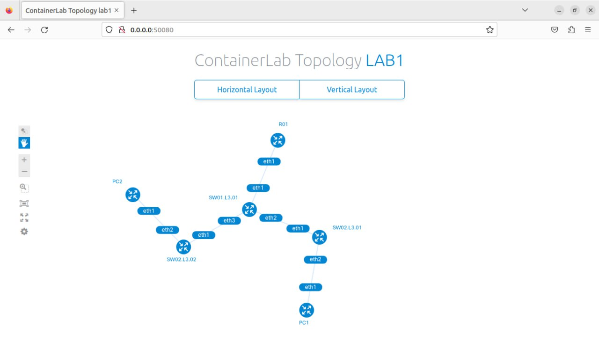
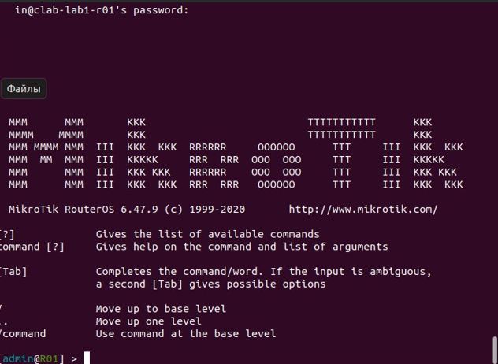
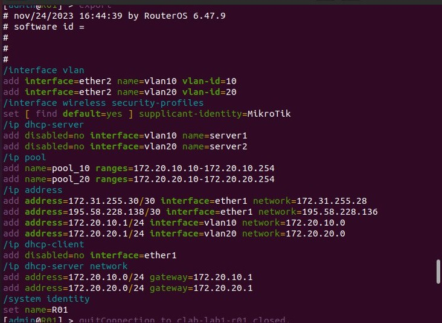
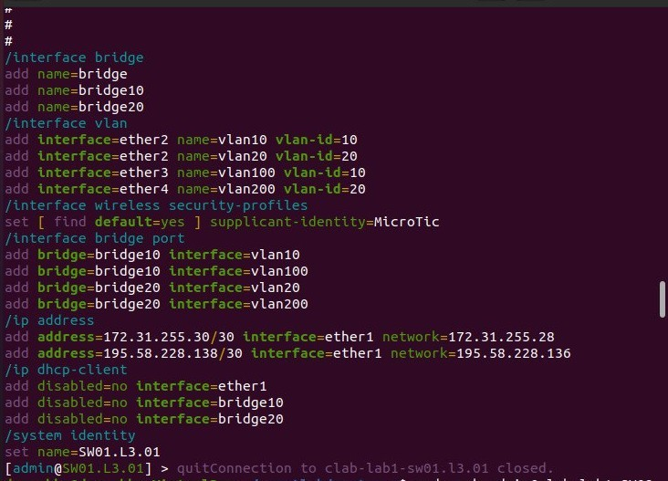
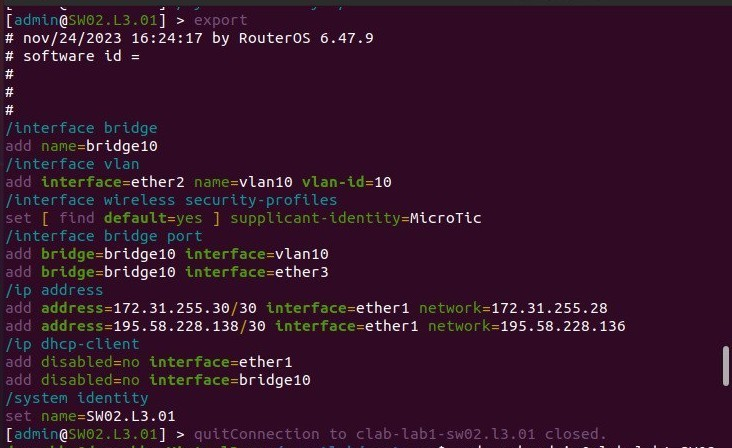
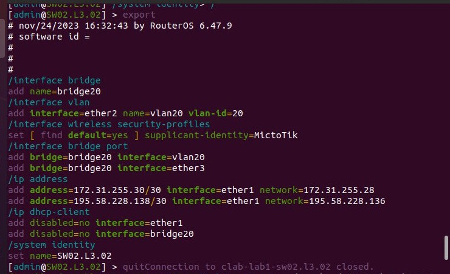
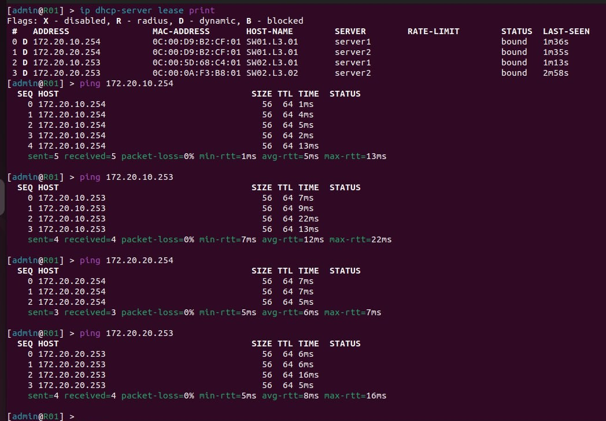

University: [ITMO University](https://itmo.ru/ru/)  
Faculty: [FICT](https://fict.itmo.ru)  
Course: [Introduction in routing](https://github.com/itmo-ict-faculty/introduction-in-routing)  
Year: 2024/2025  
Group: K3320  
Author: Morozov Matvey  
Lab: Lab1  
Date of create: 23.12.2024  
Date of finished: 24.12.2024

# Лабораторная работа №1 "Установка ContainerLab и развертывание тестовой сети связи"

## <a name="part_1">Описание</a>

В данной лабораторной работе вы познакомитесь с инструментом ContainerLab, развернете тестовую сеть связи, настроите оборудование на базе Linux и RouterOS.

## <a name="part_2">Цель работы</a>

Ознакомиться с инструментом ContainerLab и методами работы с ним, изучить работу VLAN, IP адресации и т.д.

### <a name="part_3.2">Схема связи</a>

### <a name="part_3.3">Конфигурации устройств</a>

#### Перед конфигурацией всегда есть окно с MikroTik

#### R01

#### SW01.L3.01

#### SW02.L3.01

#### SW02.L3.02

### <a name="part_4">Проверка связности</a>

