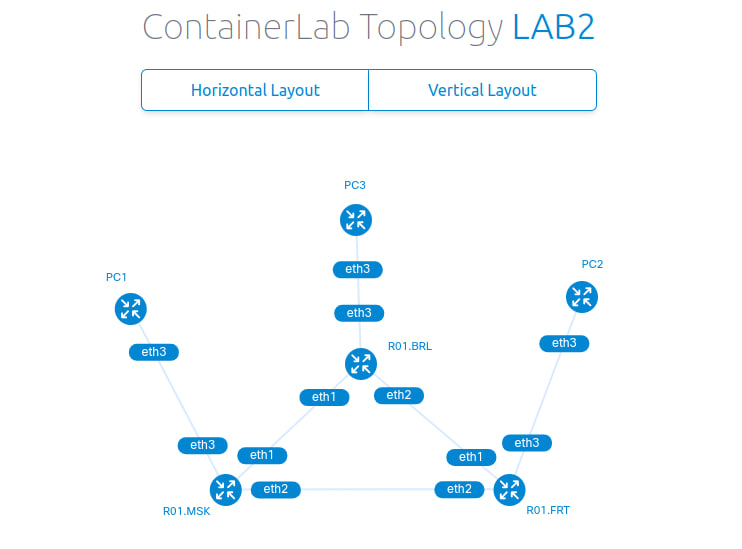
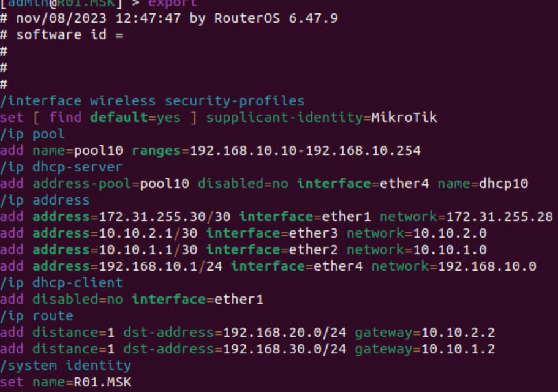
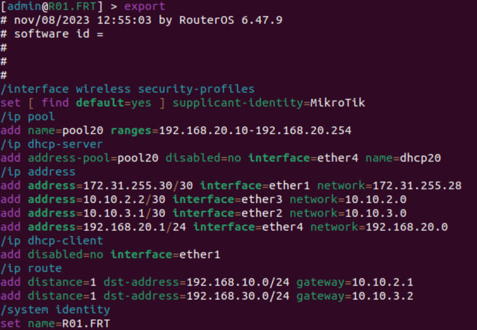
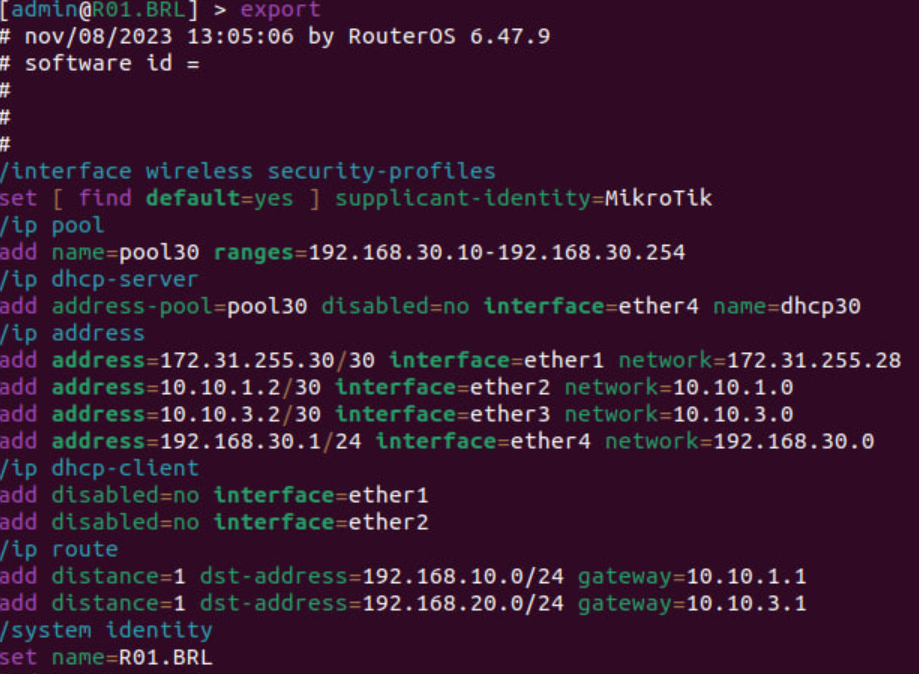
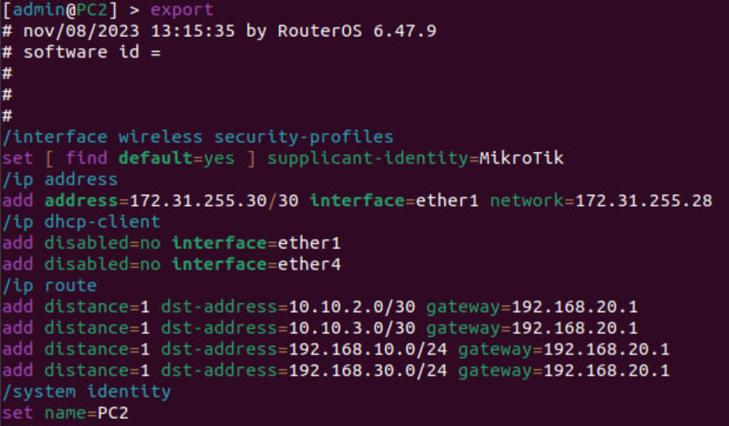
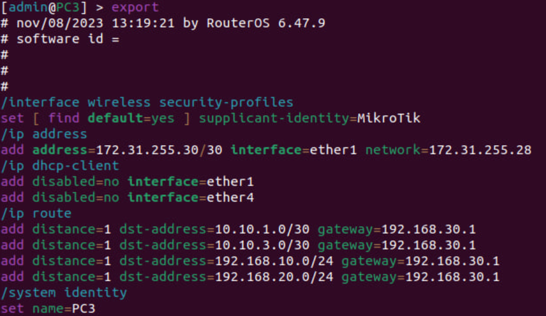
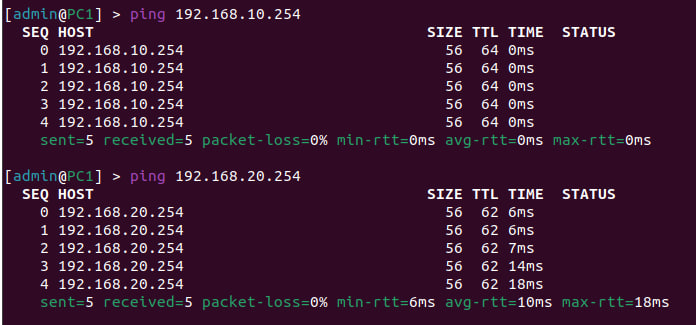
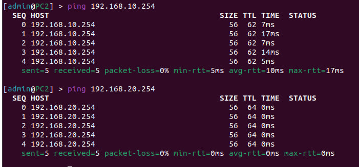
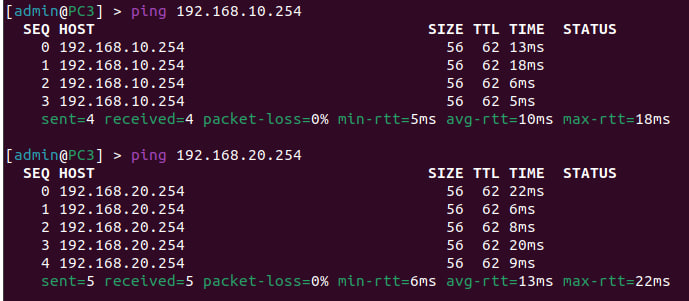

University: [ITMO University](https://itmo.ru/ru/)  
Faculty: [FICT](https://fict.itmo.ru)  
Course: [Introduction in routing](https://github.com/itmo-ict-faculty/introduction-in-routing)  
Year: 2024/2025
Group: K3320  
Author: Morozov Matvey  
Lab: Lab2  
Date of create: 23.12.2024  
Date of finished: 24.12.2024

## Лабораторная работ №2 "Эмуляция распределенной корпоративной сети связи, настройка статической маршрутизации между филиалами"

## <a> Ход работы</a>

#### <a> Построение сети связи</a>

mgmt:
network: statics
ipv4-subnet: 172.30.20.0/24

topology:
nodes:
R01.MSK:
kind: vr-ros
image: vrnetlab/vr-routeros:6.47.9
mgmt-ipv4: 172.30.20.13

    R01.BRL:
      kind: vr-ros
      image: vrnetlab/vr-routeros:6.47.9
      mgmt-ipv4: 172.30.20.14

    R01.FRT:
      kind: vr-ros
      image: vrnetlab/vr-routeros:6.47.9
      mgmt-ipv4: 172.30.20.15

    PC1:
      kind: vr-ros
      image: vrnetlab/vr-routeros:6.47.9
      mgmt-ipv4: 172.30.20.16

    PC2:
      kind: vr-ros
      image: vrnetlab/vr-routeros:6.47.9
      mgmt-ipv4: 172.30.20.17

    PC3:
      kind: vr-ros
      image: vrnetlab/vr-routeros:6.47.9
      mgmt-ipv4: 172.30.20.18

#### <a> Сборка и построение происходит также как и в прошлой работе</a>

#### <a> Далее мы используем команду sudo ssh admin@clab-lab2-Ro1.MSK с помощью этой команды мы настраиваем конфигурацию </a>

#### <a> Чтобы посмотреть конфигурацию используем команду export </a>

#### <a> Настройка R01.MSK</a>

#### <a> Настройка R01.FRT</a>

#### <a> Настройка R01.BRL</a>

#### <a> Настройка PC1</a>

#### <a> Результаты пингов:</a>

#### <a> Для этого заходим в каждый PC1 PC2 PC3 и вводим ping </a>

