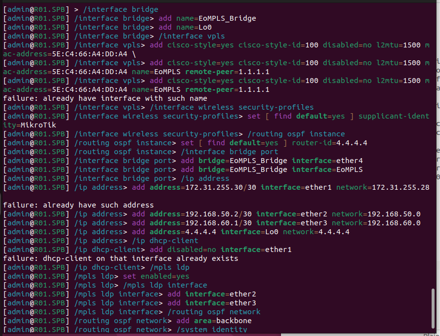

University: [ITMO University](https://itmo.ru/ru/)  
Faculty: [FICT](https://fict.itmo.ru)  
Course: [Introduction in routing](https://github.com/itmo-ict-faculty/introduction-in-routing)  
Year: 2024/2025
Group: K3320  
Author: Morozov Matvey  
Lab: Lab3  
Date of create: 24.12.2024  
Date of finished: 25.12.2024

## Лабораторная работ №3 "Эмуляция распределенной корпоративной сети связи, настройка OSPF и MPLS, организация первого EoMPLS"

## <a>Ход работы</a>

#### <a>Минимальная теория</a>

- MPLS - это метод маркировки данных через приоритетность данных (скорость увеличивается)
- OSPF - метод графа, нахождение кратчайшего пути.
- EoMPLS - EoMPLS представляет собой метод передачи Ethernet-фреймов через MPLS-сеть, позволяя нам объединить преимущества обоих протоколов.

#### <a>Первый этап</a>

- С помощью данной команды создаем папку:
  --- touch marsh3.clab.yaml---
- В файл записываем построение сети
- С помощью данной команды собираем Containerlab:
  --- sudo clab deploy marsh3.clab.yaml---
- С помощью данной команды строим нашу сеть:
  --- sudo clab graph ---

#### <a>Второй этап-настройка устройств</a>

С помощью данной команды входим в настроуку интерфейса:
--- sudo ssh admin@clab-lab3-...---

#### <a>R01.NY</a>

#### <a>R01.LDN</a>

#### <a>R01.HKI</a>

#### <a>R01.SPB</a>

#### <a>R01.MSK</a>

#### <a>R01.LBN</a>

#### <a>SGI-Prism</a>

#### <a>PC1</a>

#### <a>Результат пинга</a>

#### <a>Пример таблицы маршрутов MPLS</a>

#### <a>Вывод</a>

В ходе выполнения данной лабораторной работы мы на практике познакомились с протоколами OSPF, MPLS, EoMPLS и механизмами их организации.
