University: [ITMO University](https://itmo.ru/ru/)  
Faculty: [FICT](https://fict.itmo.ru)  
Course: [Introduction in routing](https://github.com/itmo-ict-faculty/introduction-in-routing)  
Year: 2024/2025
Group: K3320  
Author: Morozov Matvey  
Lab: Lab4  
Date of create: 24.12.2024  
Date of finished: 25.12.2024

## Лабораторная работ №4 "Эмуляция распределенной корпоративной сети связи, настройка iBGP, организация L3VPN, VPLS"

## <a>Ход работы</a>

- С помощью данной команды создаем папку:
  --- touch marsh3.clab.yaml---
- В файл записываем построение сети
- С помощью данной команды собираем Containerlab:
  --- sudo clab deploy marsh4.clab.yaml---
  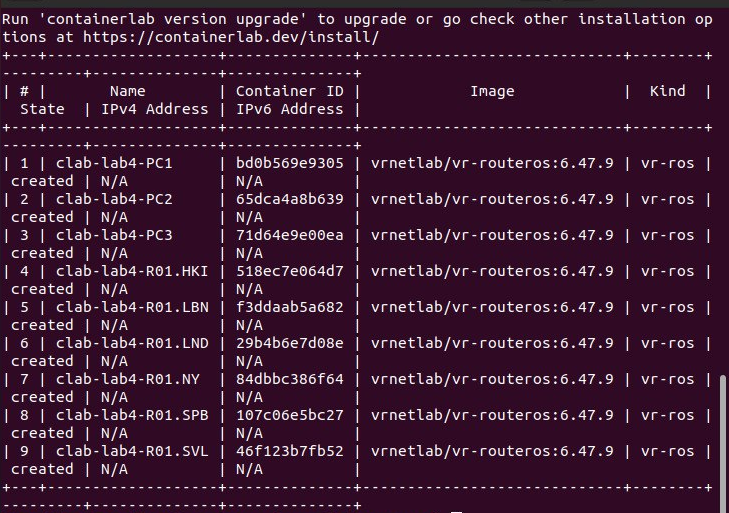

- С помощью данной команды строим нашу сеть:
  --- sudo clab graph ---
  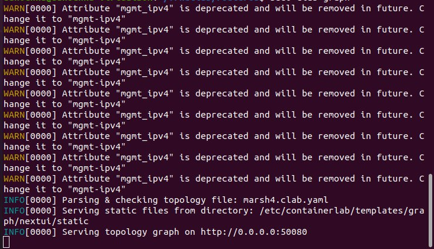
  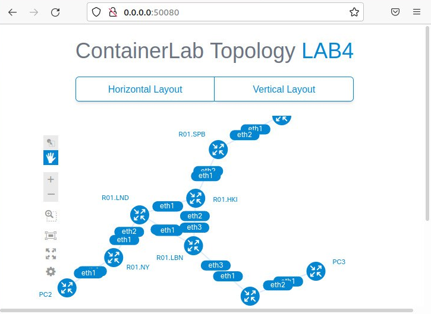

С помощью данной команды входим в настроуку интерфейса:
--- sudo ssh admin@clab-lab4-...---

### <a>Текст конфигураций для каждого сетевого устройства</a>

#### <a>Настройка R01_NY:</a>

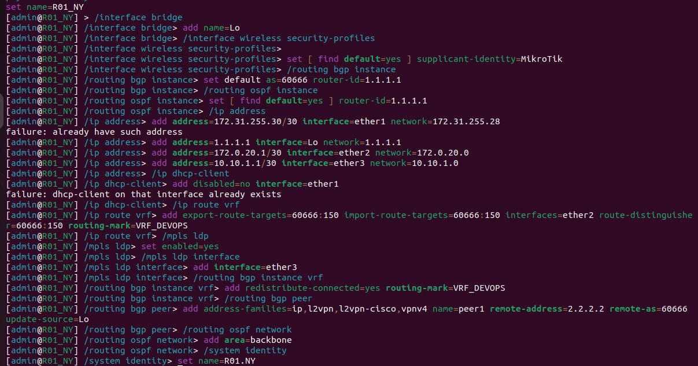

#### <a>Настройка R01_SBP:</a>

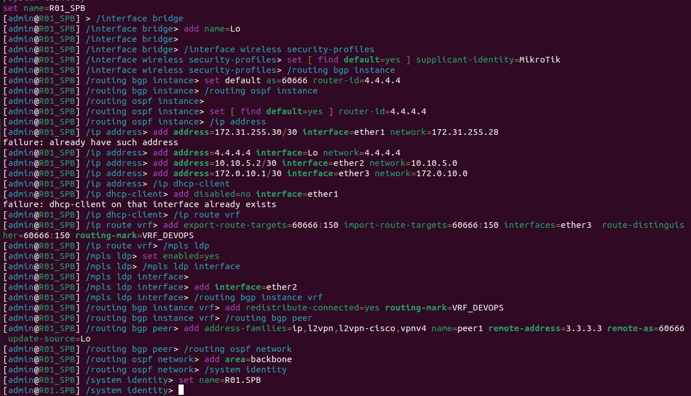

#### <a>Настройка R01_SVL:</a>

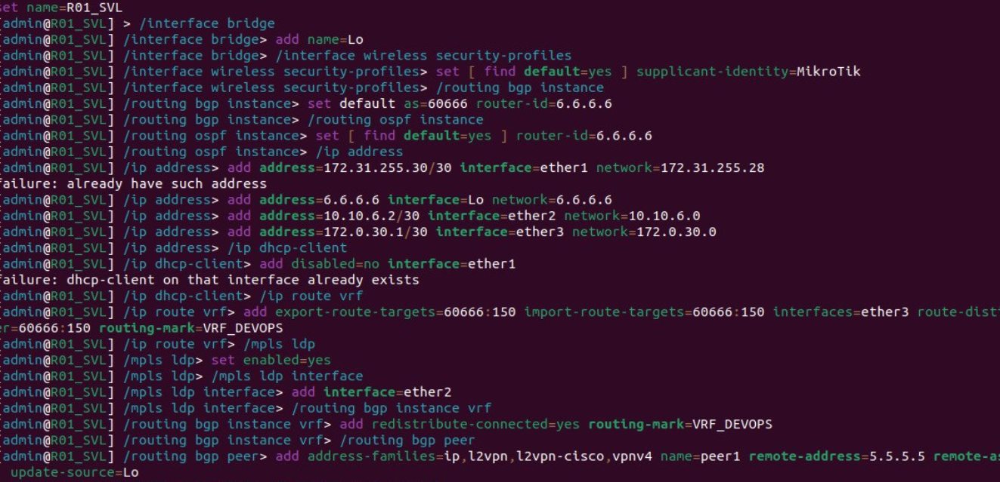

#### <a>Настройка R01_HKI:</a>

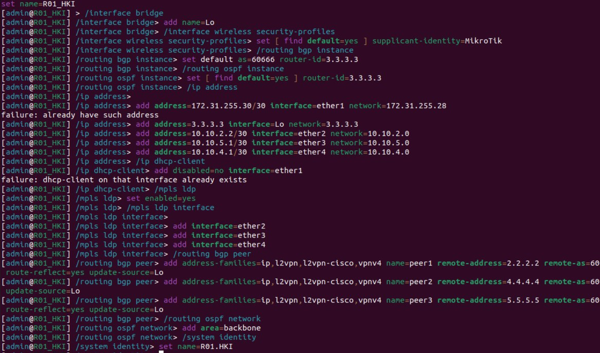

#### <a>Настройка R01_LND:</a>

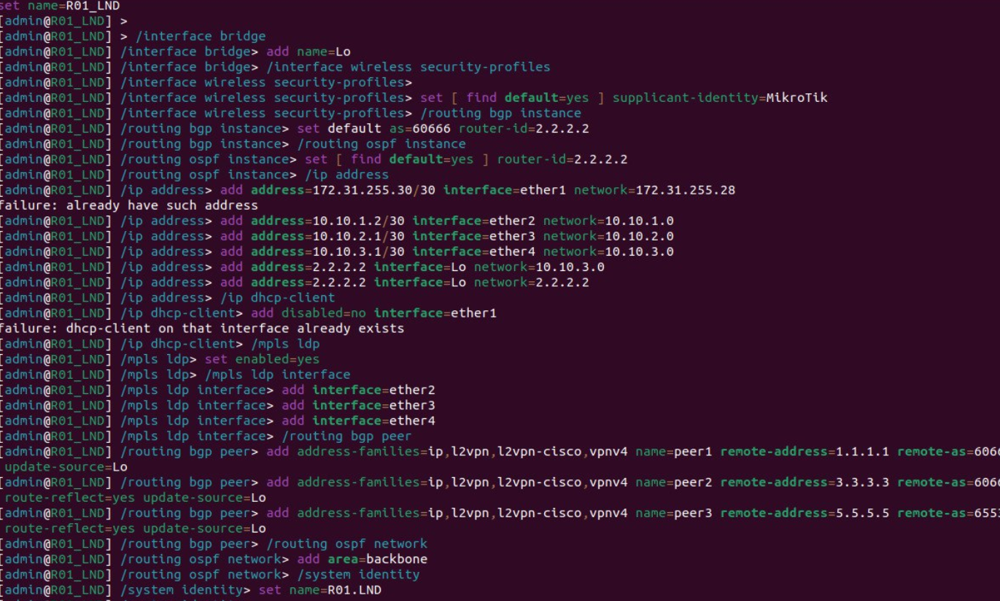

#### <a>Настройка R01_LBN:</a>

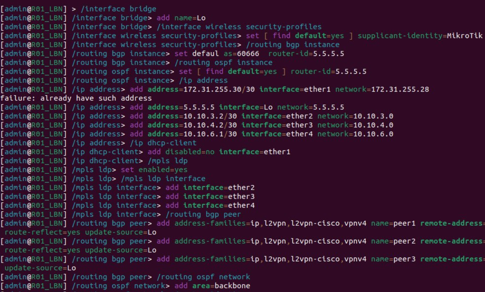

### <a>Результаты пингов. Проверка связности VRF:</a>

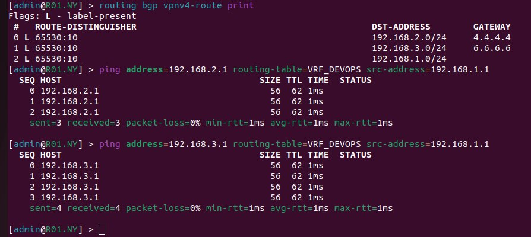
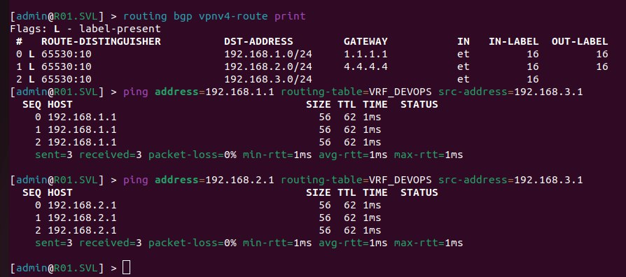
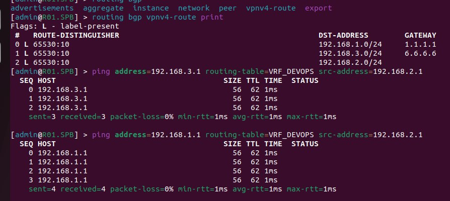

#### <a>Настройка PC1:</a>

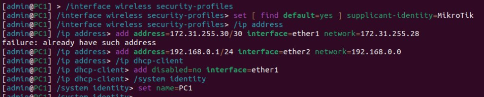

#### <a>Настройка PC2:</a>

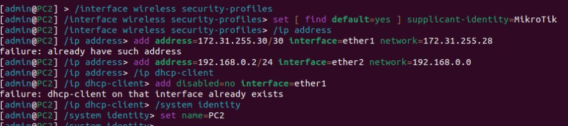

#### <a>Настройка PC3:</a>

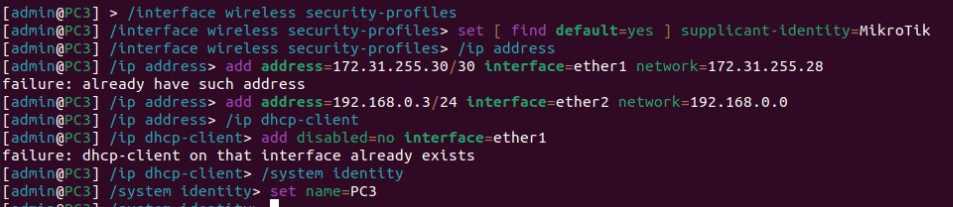

#### <a>Настройка R01_SVL:</a>

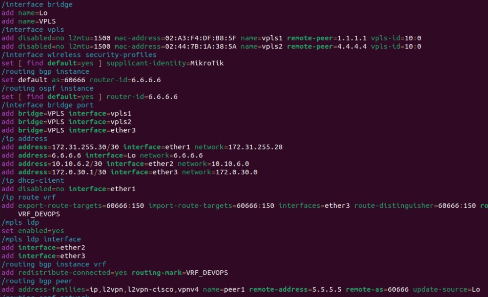

#### <a>Настройка R01_NY:</a>

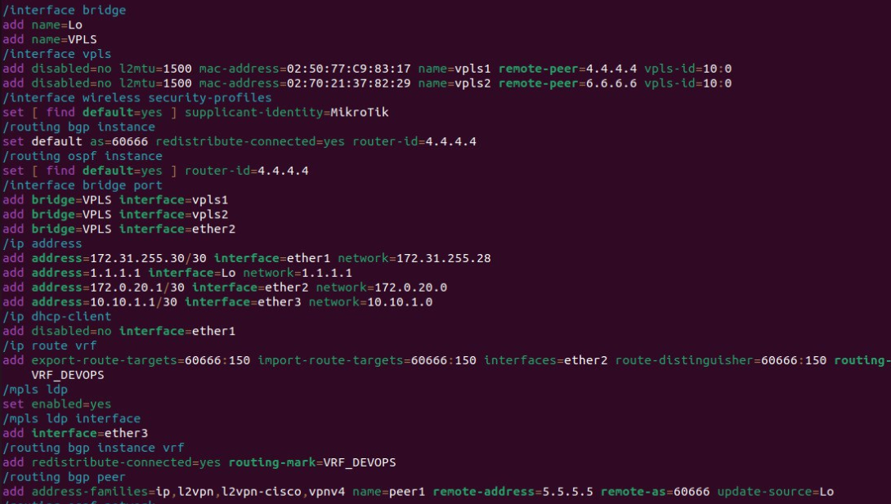

#### <a>Настройка R01_SPB:</a>

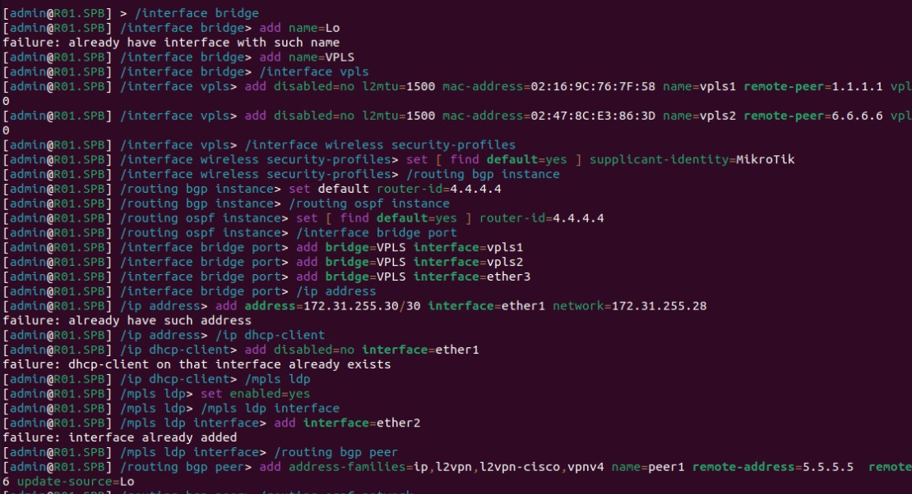

### <a>Результаты пингов.</a>

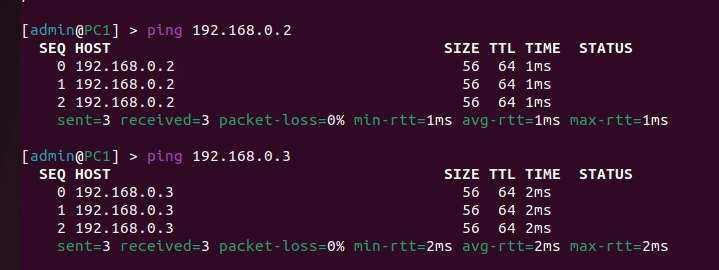
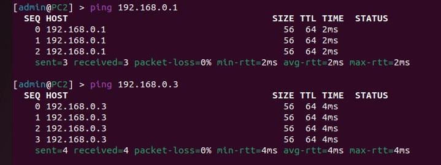
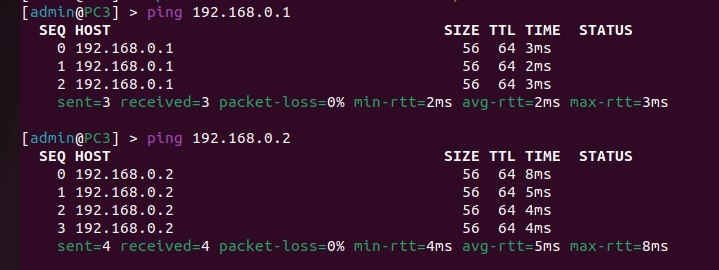
